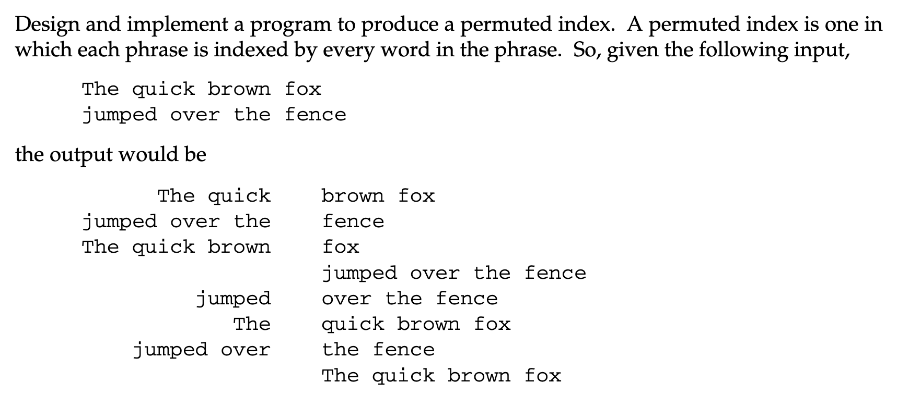

# What is a Permuted Index?

Consider these 2 pages:

- Page 0: Wikipedia, The Free Encyclopedia
- Page 1: KWIC is an acronym for Key Word In Context, the most common format for concordance lines

These might yield a KWIC index as follows:

| Phrase | | | Page |
| --- | --- | --- | ---|
| KWIC is an | **acronym** | for Key Word In Context, ... | 1 |
| ... Key Word In Context, the most | **common** | format for concordance lines. | 1 |
| ... the most common format for | **concordance** | lines. | 1 |
| ... is an acronym for Key Word In | **Context**, | the most common format ... | 1 |
| Wikipedia, The Free | **Encyclopedia** | | 0 |
| ... In Context, the most common | **format** | for concordance lines. | 1 |
| Wikipedia, The | **Free** | Encyclopedia | 0 |
| KWIC is an acronym for | **Key** | Word In Context, the most ... | 1 |
| | **KWIC** | is an acronym for Key Word ... | 1 |
| ... common format for concordance | **lines**. | | 1 |
| ... for Key Word In Context, the | **most** | common format for concordance ... | 1 |
| | **Wikipedia**, | The Free Encyclopedia | 0 |
| KWIC is an acronym for Key | **Word** | In Context, the most common ... | 1 |

A Permuted Index Page lists the Permuted Indices (in **bold text**), sorted in alphabetical order for ease of lookup. Nice thing about a Permuted Index Page is that it allows us not only to find out quickly where the Permuted Index (a.k.a Key Word in Context (KWIC)) “word” is with respect to the article, it also exposes some texts one the left and right of the Permuted Index.

## Exercise 5.1 in the book

We are given the following example


To better explain the output (credit: [Johnny Chan](http://mathalope.co.uk/2014/08/26/accelerated-c-solution-to-exercise-5-1/))


The Permuted Index Page listed above is the output of my C++ program. “Block 1” and “Block 2” essentially are what the Author asks us to produce. “Block 3” and “Block 4” are the “extras”

To be able to use this output (a Permuted Index Page), we first need to know that the first words of “Block 2” are the Permuted Indices. i.e. the red bold words in the picture!

## Hints (as given in the book)

A good algorithm is suggested in The AWK Programming Language by Aho, Kernighan, and Weinberger (Addison-Wesley, 1988). That solution divides the problem into three steps:  

1. Read each line of the input and generate a set of rotations of that line. Each rotation puts the next word of the input in the first position and rotates the previous first word to the end of the phrase. So the output of this phase for the first line of our input would be

   ```text
   The quick brown fox 
   quick brown fox The 
   brown fox The quick 
   fox The quick brown
   ```

   Of course, it will be important to know where the original phrase ends and where the rotated beginning begins.
2. Sort the rotations.  
3. Unrotate and write the permuted index, which involves finding the separator, putting the phrase back together, and writing it properly formatted.
